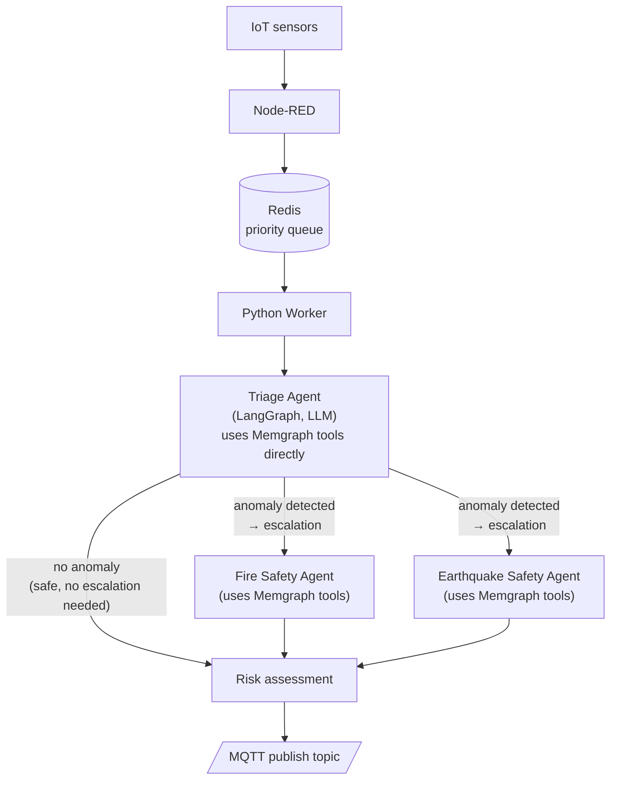

# Emergency Agent Worker

An asynchronous Python worker that evaluates fire and earthquake risk in a building in real time, based on IoT sensor data. The system uses a swarm of LLM agents (via **LangGraph**) organized with a **map-reduce** pattern: a triage agent routes data to specialized experts (fire, earthquake), which in turn query a **Memgraph** graph containing the building's topology to assess hazard propagation between adjacent rooms.

> ⚠️ Research project / prototype. It is not intended to be the sole safety system of a real building.

## How it works



1. **Node-RED** collects data from the sensors (via ThingsBoard/department VPN) and writes it to **Redis** as timestamp-ordered snapshots, in a priority queue (`room_pq`).
2. The **worker** (`main.py`) pops rooms from the Redis queue, rebuilds the history of sensor snapshots, and sends them to the agent swarm.
3. The LangGraph graph (`agent_graph.py`) first runs a **triage agent**. This agent can itself query **Memgraph** (through the tools in `memgraph_custom_tools.py`) to inspect the building's topology and current sensor snapshots. If both the telemetry and the graph data look safe, the triage agent produces the final assessment directly, **without** escalating to any expert. Only when it detects an anomaly does it escalate, indicating which specialized experts (`fire`, `earthquake`) are required.
4. The **expert agents**, once escalated to, also query **Memgraph** to read the building's topology (adjacent rooms, ventilation paths, structural dependencies) and understand how the hazard could propagate.
5. The final result (a list of `ThreatAssessment` objects, including risk level, hazard type, score, and justification) — coming either directly from triage or from the escalated experts — is published to an **MQTT** topic.
6. **Langfuse** can be enabled to trace and observe the LLM calls.

## Tech stack

| Component | Role |
|---|---|
| [LangGraph](https://github.com/langchain-ai/langgraph) / [LangChain](https://github.com/langchain-ai/langchain) | Orchestration of the agent swarm (triage → experts) |
| LLM via OpenAI-compatible API (e.g. [OpenRouter](https://openrouter.ai/)) | Agent reasoning |
| [Memgraph](https://memgraph.com/) + Memgraph MAGE/Lab/MCP | Building topology graph, queried by the expert agents |
| [Redis](https://redis.io/) | Priority queue of sensor snapshots to process |
| [Node-RED](https://nodered.org/) | Ingestion/routing of IoT sensor data |
| [aiomqtt](https://github.com/sbtinstruments/aiomqtt) | Publishing results to an MQTT broker |
| [ThingsBoard MCP](https://github.com/thingsboard) | MCP tool for accessing data from the ThingsBoard IoT platform |
| [Langfuse](https://langfuse.com/) | Optional observability/tracing of LLM calls |
| Python ≥ 3.14, [uv](https://docs.astral.sh/uv/) | Runtime and dependency management |

## Repository structure

| File | Description |
|---|---|
| `main.py` | Worker entry point: reads from the Redis queue, orchestrates processing, and publishes results to MQTT |
| `agent_graph.py` | LangGraph graph definition (`HazardMapReduceManager`): states, Pydantic output schemas, and triage/fire/earthquake nodes |
| `agent_swarm_prebuilts.py` | Prebuilt components/agents reused within the swarm |
| `memgraph_custom_tools.py` | Custom tools exposed to the agents for querying the Memgraph database |
| `app_settings.py` | App configuration based on `pydantic-settings` (read from `.env`) |
| `place_graph.json` | Building topology definition/dataset to load into Memgraph |
| `nodered_config.yml` | Node-RED flow configuration |
| `node_red_data/` | Persistent data for the Node-RED container |
| `docker-compose.yml` | Supporting services stack (Node-RED, Redis, Memgraph, Memgraph Lab, ThingsBoard MCP, Memgraph MCP) |
| `.env.example` | Example of the required environment variables |

## Prerequisites

- Python **3.14+**
- [uv](https://docs.astral.sh/uv/getting-started/installation/) for dependency management
- Docker and Docker Compose for the supporting services (Redis, Memgraph, Node-RED, etc.)
- An OpenAI-compatible API key for the LLM (e.g. [OpenRouter](https://openrouter.ai/))
- A reachable MQTT broker (for publishing results)

## Installation

```bash
git clone https://github.com/nicol-buratti/emergency-agent-worker.git
cd emergency-agent-worker

# install dependencies with uv
uv sync
```

## Configuration

Copy the example file and fill in the values:

```bash
cp .env.example .env
```

Main variables (see `app_settings.py` and `main.py`):

| Variable | Description | Default |
|---|---|---|
| `LLM_MODEL` | Primary LLM model (OpenRouter-compatible format) | `gpt-4` |
| `LLM_API_KEY` | API key for the LLM provider | *required* |
| `LLM_BASE_URL` | Base URL of the OpenAI-compatible endpoint | `https://openrouter.ai/api/v1` |
| `EXTRA_LLM_MODELS` | JSON list of fallback/alternative models | — |
| `LANGFUSE_ENABLED` | Enables Langfuse tracing | `false` |
| `REDIS_HOST` | Redis server host | `localhost` |
| `REDIS_PORT` | Redis server port | `6379` |
| `QUEUE_NAME` | Name of the Redis priority queue to consume | `room_pq` |
| `MQTT_BROKER_ADDRESS` | MQTT broker address | `localhost` |
| `MQTT_PUBLISH_TOPIC` | MQTT topic to publish results to | `emergency/agent/data` |

If you use Langfuse, also make sure to set the related keys/host required by the SDK (`LANGFUSE_PUBLIC_KEY`, `LANGFUSE_SECRET_KEY`, `LANGFUSE_HOST`).

## Starting the supporting services

The `docker-compose.yml` file starts Node-RED, Redis, Memgraph (MAGE), Memgraph Lab, the ThingsBoard MCP connector, and the Memgraph MCP server:

```bash
docker compose up -d
```

> Note: some containers use `network_mode: host` to access the department's sensor data over VPN during development — adjust this to your environment as needed.

Default exposed services:

| Service | Port | Notes |
|---|---|---|
| Node-RED | `1880` | Ingestion flows UI |
| Redis | `6379` | Priority queue |
| Memgraph (Bolt) | `7687` | Graph database |
| Memgraph (log/monitor) | `7444` | — |
| Memgraph Lab | `3000` | Graph administration UI |
| ThingsBoard MCP | `8000` | MCP tool for the ThingsBoard platform |
| Memgraph MCP | `8001` | Read-only MCP tool for querying Memgraph |

## Running the worker

Once the supporting services are up and `.env` is configured:

```bash
uv run main.py
```

The worker listens on the Redis queue (`QUEUE_NAME`), pops the highest-priority rooms, rebuilds the sensor snapshot history, sends it to the agent swarm, and publishes each risk assessment to the configured MQTT topic. Shutdown is handled gracefully via `SIGINT`/`SIGTERM`.

## Output format

Each assessment published on MQTT follows the `ThreatAssessment` schema:

```json
{
  "room": "room-101",
  "warning": "none | pre-alert",
  "danger": "none | low | medium | high",
  "danger_type": "none | fire | smoke | heat | earthquake | other",
  "danger_score": 0.0,
  "justification": "Brief justification for the assessment"
}
```

## Roadmap / future ideas

- Extend the expert agents to hazard types beyond fire and earthquake
- Improve triage routing with more historical context per room
- Add automated tests and CI

## License

No license file is present in the repository at the time of writing this README.
